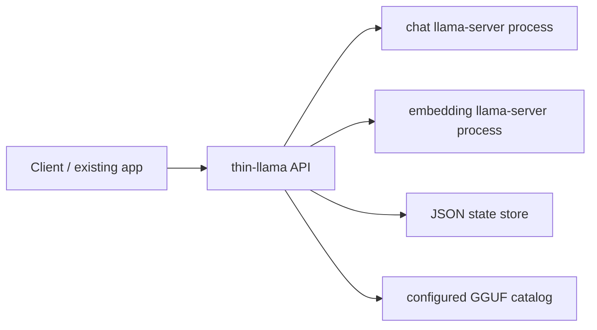

# thin-llama

`thin-llama` is a lightweight Go wrapper around `llama.cpp` `llama-server` built for small machines that do not need the full Ollama runtime. It runs one active chat model and one active embedding model, manages them as subprocesses, and exposes a minimal Ollama-compatible API surface for existing apps.

The goal is narrow by design:
- single binary
- single Docker image
- JSON config
- local model catalog and pull flow
- Ollama-compatible endpoints first

This project is intended to replace Ollama for constrained self-hosted setups where you want tighter control over model files, process lifecycle, and runtime overhead.

## Current API surface

- `GET /health`
- `GET /api/tags`
- `POST /api/chat`
- `POST /api/embed`
- `POST /api/pull`
- `GET /metrics`

The wrapper proxies chat and embedding requests to dedicated `llama-server` subprocesses and translates responses into Ollama-like JSON.

## Architecture



## Project layout

```text
cmd/thin-llama          CLI entrypoint
internal/cli            subcommands
internal/config         JSON config loading and validation
internal/httpapi        Ollama-compatible HTTP handlers
internal/models         model catalog resolution
internal/pull           local download and checksum verification
internal/runtime        llama-server subprocess supervision
internal/state          persistent JSON state store
internal/metrics        Prometheus metrics
```

## Configuration

Example config: [`config.example.json`](/Users/krzysztofkotlowski/Desktop/thin-llama/config.example.json)

Key fields:
- `listen_addr`
- `state_dir`
- `models_dir`
- `llama_server_bin`
- `active.chat`
- `active.embedding`
- `models[]`

Each configured model declares:
- `name`
- `role`
- `gguf_path`
- optional `source_url`
- optional `sha256`
- `embedding_dims` for embedding models
- runtime settings such as `threads`, `context_size`, `gpu_layers`, `extra_args`, `port`

## Local development

Prerequisites:
- Go `1.26.1`
- Docker if you want the container flow
- a `llama-server` binary available locally or through the container image
- real GGUF files for live runtime smoke tests

Common commands:

```bash
go mod tidy
make fmt
make test
make validate-config
make run
```

For a real local smoke test, create an untracked runtime config first:

```bash
cp config.example.json config.local.json
mkdir -p models state
```

Then update `config.local.json` so its `gguf_path` values exactly match the filenames you place in `./models`.

List configured models:

```bash
go run ./cmd/thin-llama models --config ./config.example.json
```

Pull a configured model:

```bash
go run ./cmd/thin-llama pull --config ./config.example.json --model all-minilm
```

## Dockerized appliance mode

The Dockerfile builds `thin-llama`, copies in `llama-server`, and starts the wrapper as PID 1 under `tini`.

Volumes:
- `/models`
- `/state`
- `/config`

Run with Docker Compose:

```bash
THIN_LLAMA_CONFIG=./config.local.json docker compose up --build
```

The included compose file mounts:
- `./models -> /models`
- `./state -> /state`
- `${THIN_LLAMA_CONFIG:-./config.example.json} -> /config/config.json`

By default, Compose uses `linux/amd64` so the image matches common `llama.cpp` server binaries and x86_64 deployment targets. Override `THIN_LLAMA_PLATFORM` if you have a native image path you want to test.

For a one-off image build:

```bash
docker build --platform linux/amd64 -t thin-llama:local .
```

## Notes

- The Docker image assumes the official `llama.cpp` server image publishes `/app/llama-server`.
- The current build targets a small self-hosted appliance model, not a multi-user service.
- Only configured catalog models can be pulled in v1. There is no remote model registry lookup.
- `config.example.json` is illustrative. It is not a turnkey runtime config because its `source_url` values are placeholders.
