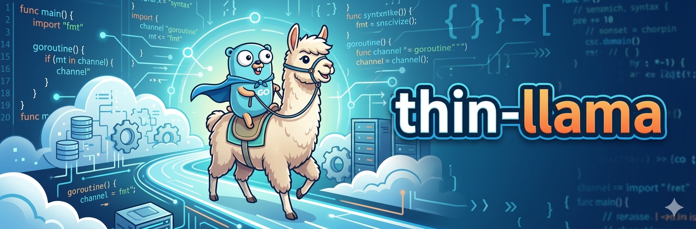
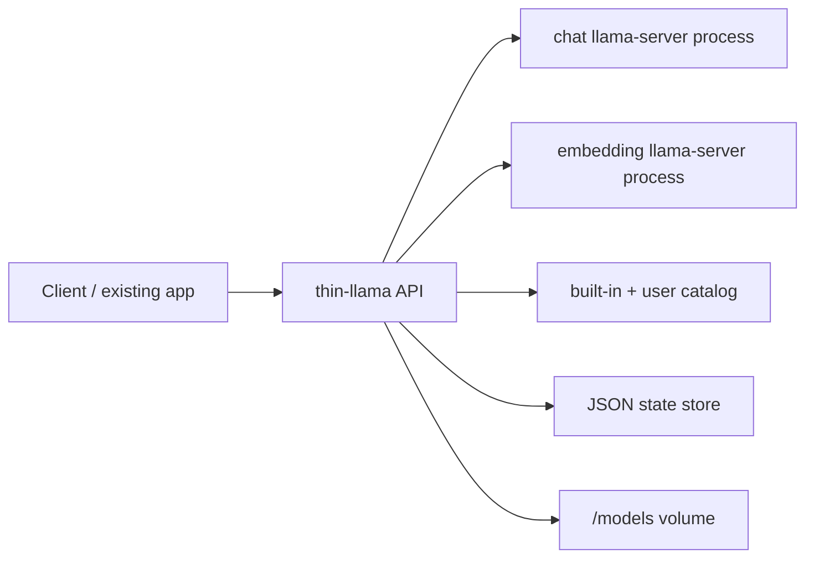

# thin-llama

`thin-llama` is a lightweight Go control plane for `llama.cpp` on small machines. It supervises `llama-server` subprocesses for chat and embeddings, keeps runtime state in JSON, and exposes an Ollama-compatible API for existing apps that do not need the full Ollama runtime.

The scope is:

- single binary
- single Docker image
- JSON config
- built-in curated model catalog
- explicit `pull` then `use` workflow
- Ollama-compatible chat and embedding endpoints first
- stable runtime identity and management endpoints for external consumers

It is designed for constrained self-hosted setups where you want lower runtime overhead, direct control over GGUF files, and a container that can boot empty and manage its own models.

## API surface

Ollama-compatible endpoints:

- `GET /health`
- `GET /api/runtime`
- `GET /api/tags`
- `POST /api/chat`
- `POST /api/embed`
- `POST /api/pull`

thin-llama management endpoints:

- `GET /api/models`
- `POST /api/models/active`
- `GET /metrics`

`/api/runtime` identifies the runtime, build version, Git ref, and supported capabilities. `/api/tags` returns only models that are already available locally. `/api/models` exposes the full merged catalog plus active/download/runtime status, including embedding dimensions for embedding models.

## Architecture



## Built-in catalog

The image ships with a small curated catalog for low-resource machines. The current defaults are:

- `qwen2.5:7b` for chat
- `bge-base-en:v1.5` for embeddings

The binary embeds this catalog and merges user overrides from [`config.local.json`](/Users/krzysztofkotlowski/Desktop/thin-llama/config.local.json) by model name.

Current built-in defaults:

| Model               | Role        | File                               | Notes                                  |
| ------------------- | ----------- | ---------------------------------- | -------------------------------------- |
| `qwen2.5:7b`        | `chat`      | `qwen2.5-7b-instruct-q4_k_m.gguf`  | balanced home-server default chat      |
| `qwen2.5:3b`        | `chat`      | `qwen2.5-3b-instruct-q4_k_m.gguf`  | smaller fallback chat model            |
| `bge-base-en:v1.5`  | `embedding` | `bge-base-en-v1.5-q4_k_m.gguf`     | `768`-dim embedding default            |
| `all-minilm`        | `embedding` | `all-minilm-l6-v2-q4_k_m.gguf`     | `384`-dim fallback embedding model     |

The built-in runtime profile is intentionally conservative for small CPU-only hosts:

- lower thread count
- reduced context size
- one server slot per role
- prompt cache disabled
- warmup disabled
- smaller batch and ubatch sizes

These defaults trade peak throughput for stability on machines like 6-core / 16 GB home servers.

## Runtime model

At startup, `thin-llama`:

1. loads `config.local.json`
2. loads the embedded catalog
3. merges config overrides on top of the built-in catalog
4. loads `state.json`
5. starts only the roles whose active model is selected and already downloaded

If no models are downloaded yet, the service still boots and `/health` returns HTTP `200` with degraded per-role readiness. The control plane is available immediately, then models can be pulled and activated without editing config or restarting the API.

That means a fresh container behaves like this:

- API is up
- `/api/models` shows the built-in catalog
- `/api/tags` is empty
- `/api/models/active` rejects activation until the requested model has been pulled

## Project layout

```text
cmd/thin-llama          CLI entrypoint
internal/cli            subcommands
internal/config         JSON config loading and validation
internal/httpapi        Ollama-compatible and management HTTP handlers
internal/models         built-in catalog + override merge
internal/pull           local download and checksum verification
internal/runtime        llama-server subprocess supervision
internal/state          persistent JSON state store
internal/metrics        Prometheus metrics
```

## Configuration

Tracked default runtime config: [`config.local.json`](/Users/krzysztofkotlowski/Desktop/thin-llama/config.local.json)

The default config is:

- `listen_addr`
- `state_dir`
- `models_dir`
- `llama_server_bin`
- `startup_timeout_seconds`
- optional `active.chat`
- optional `active.embedding`
- optional `models[]` overrides/additions

`models[]` is not the only source of truth anymore. It extends or overrides the built-in catalog by name.

Each model entry supports:

- `name`
- `role`
- `gguf_path`
- optional `source_url`
- optional `sha256`
- `embedding_dims` for embedding models
- optional runtime knobs such as `threads`, `context_size`, `gpu_layers`, `extra_args`, `port`

`startup_timeout_seconds` defaults to `60` and controls how long thin-llama waits for each `llama-server` subprocess to become reachable on slower CPU-only hosts.

## Local development

Prerequisites:

- Go `1.26.1`
- Docker for the container flow
- network access if you want to `pull` models

Common commands:

```bash
go mod tidy
make fmt
make test
make validate-config
make run
```

Direct CLI usage:

```bash
go run ./cmd/thin-llama serve --config ./config.local.json
go run ./cmd/thin-llama models --config ./config.local.json
go run ./cmd/thin-llama pull --config ./config.local.json --model bge-base-en:v1.5
go run ./cmd/thin-llama use --config ./config.local.json --embedding bge-base-en:v1.5
```

List catalog models and current state:

```bash
go run ./cmd/thin-llama models --config ./config.local.json
```

Pull a built-in model:

```bash
go run ./cmd/thin-llama pull --config ./config.local.json --model bge-base-en:v1.5
```

Activate pulled models:

```bash
go run ./cmd/thin-llama use --config ./config.local.json --chat qwen2.5:7b --embedding bge-base-en:v1.5
```

## Docker quickstart

The image bakes in `config.local.json`, so it can boot with no external config mount.

Run it as a local appliance:

```bash
docker run -d \
  --name thin-llama \
  -p 8080:8080 \
  -v thin-llama-models:/models \
  -v thin-llama-state:/state \
  thin-llama:local
```

Or with Compose:

```bash
docker compose up --build
```

This creates two named volumes:

- `thin-llama-models` mounted at `/models`
- `thin-llama-state` mounted at `/state`

Check the empty boot state:

```bash
curl -s http://localhost:8080/health
curl -s http://localhost:8080/api/runtime
curl -s http://localhost:8080/api/models
curl -s http://localhost:8080/api/tags
```

Expected behavior before any pulls:

- `/health` returns HTTP `200`
- `runtime_ready` is `false`
- `/api/models` lists the built-in catalog with `available=false`
- `/api/tags` returns `{"models":[]}`

Then pull and activate models through the API:

```bash
curl -s http://localhost:8080/api/pull \
  -H 'Content-Type: application/json' \
  -d '{"model":"bge-base-en:v1.5"}'

curl -s http://localhost:8080/api/pull \
  -H 'Content-Type: application/json' \
  -d '{"model":"qwen2.5:7b"}'

curl -s http://localhost:8080/api/models/active \
  -H 'Content-Type: application/json' \
  -d '{"chat":"qwen2.5:7b","embedding":"bge-base-en:v1.5"}'
```

After that, the Ollama-compatible endpoints are ready:

```bash
curl -s http://localhost:8080/api/tags

curl -s http://localhost:8080/api/embed \
  -H 'Content-Type: application/json' \
  -d '{"model":"bge-base-en:v1.5","input":["golang","vector search"]}'

curl -s http://localhost:8080/api/chat \
  -H 'Content-Type: application/json' \
  -d '{"model":"qwen2.5:7b","stream":false,"messages":[{"role":"user","content":"Reply with exactly: thin-llama ok"}]}'
```

You can also manage models through the CLI inside the running container:

```bash
docker exec thin-llama thin-llama models --config /app/config.local.json
docker exec thin-llama thin-llama pull --config /app/config.local.json --model bge-base-en:v1.5
docker exec thin-llama thin-llama use --config /app/config.local.json --embedding bge-base-en:v1.5
```

Build the image directly:

```bash
docker build --platform linux/amd64 -t thin-llama:local .
```

## Operational notes

- `pull` is synchronous in v1.
- `use` is explicit; activation does not implicitly download models.
- `/health` reports control-plane readiness, not “both runtimes already loaded”.
- `/api/tags` shows only installed models so Ollama-oriented clients see a realistic local inventory.
- built-in catalog entries can be overridden by name in `config.local.json`
- state is persisted in `/state/state.json`
- The container is intended for local/private-network use and does not implement auth or multi-user isolation.
